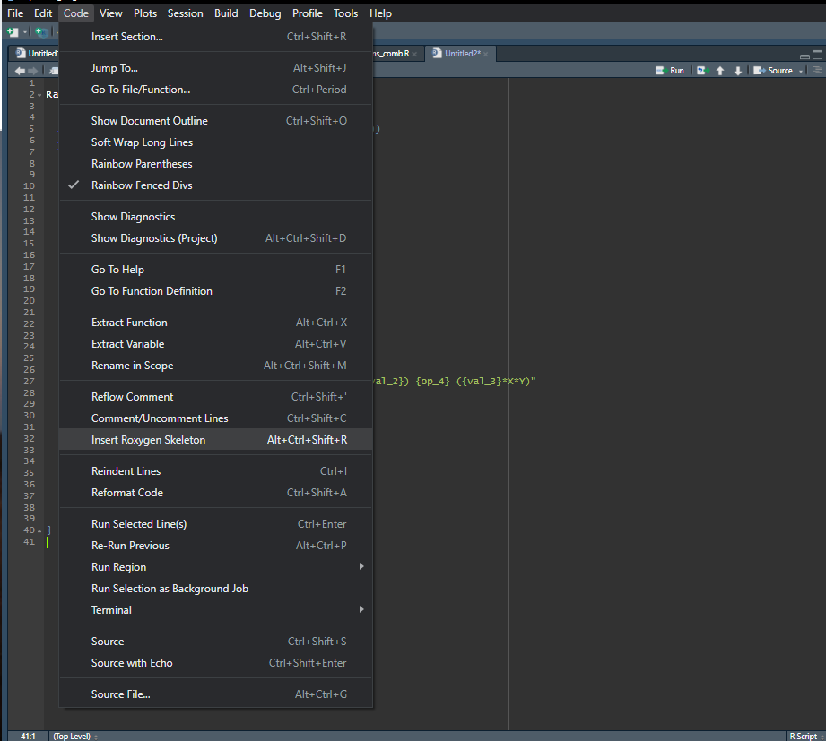

```{css, echo=FALSE}
.blackbox {
  padding: 1em;
  background: #e7e8e2;
  color: #332;
  border: 1px solid #f3b160;
  border-radius: 10px;
}
.center {
  text-align: center;
}
/* Two-column layout */
.left-column {
  color: #777;
  width: 20%;
  height: 92%;
  float: left;
}
.left-column h2:last-of-type, .left-column h3:last-child {
  color: #000;
}
.right-column {
  width: 75%;
  float: right;
  padding-top: 1em;
}
.pull-left {
  float: left;
  width: 47%;
}
.pull-right {
  float: right;
  width: 47%;
}
.pull-right + * {
  clear: both;
}

/* Metropilis style*/
.remark-slide-content {
  background-color: #FAFAFA;
  border-top: 80px solid #23373B;
  font-size: 20px;
  font-weight: 300;
  line-height: 1.5;
  padding: 1em 2em 1em 2em
}

.title-slide .inverse .remark-slide-content {
  background-color: #FAFAFA;
}

.inverse {
  background-color: #23373B;
  text-shadow: none;
}

/* Removes colored bar from top of the slide resulting in a clear slide */
.clear{
  border-top: 0px solid #FAFAFA;
}

h1 {
  font-weight: normal;
  margin-top: -95px;
  margin-left: -00px;
  color: #FAFAFA;
}

h2, h3, h4 {
  padding-top: -15px;
  padding-bottom: 00px;
  color: #1A292C;
  text-shadow: none;
  font-weight: 400;
  text-align: left;
  margin-left: 00px;
  margin-bottom: -10px;
}

.remark-slide-content h1 {
  font-size: 45px;
}

.remark-slide-content h2 {
  font-size: 35px;
}

.remark-slide-content h3 {
  font-size: 30px;
}

.left-column h2, .left-column h3, .left-column h4 {
  color: #777;
}

.left-column h2:last-of-type, .left-column h3:last-child {
  color: #1A292C;
}

.title-slide {
  background-color: #FAFAFA;
  border-top: 80px solid #FAFAFA;
}

.title-slide h1  {
  color: #1A292C;
  font-size: 40px;
  text-shadow: none;
  font-weight: 400;
  text-align: left;
  margin-left: 15px;
  padding-top: 80px;
}
.title-slide h2  {
  margin-top: -25px;
  padding-bottom: -20px;
  color: #1A292C;
  text-shadow: none;
  font-weight: 300;
  font-size: 35px;
  text-align: left;
  margin-left: 15px;
}
.title-slide h3  {
  color: #1A292C;
  text-shadow: none;
  font-weight: 300;
  font-size: 25px;
  text-align: left;
  margin-left: 15px;
  margin-bottom: -30px;
}

hr, .title-slide h2::after, .mline h1::after {
  content: '';
  display: block;
  border: none;
  background-color: #EB811B;
  color: #EB811B;
  height: 1px;
}

hr, .mline h1::after {
  margin: 1em 15px 0 15px;
}

.title-slide h2::after {
  margin: 10px 15px 35px 0;
}

.mline h1::after {
  margin: 10px 15px 0 15px;
}

.remark-slide-number {
  font-size: 13pt;
  color: #272822;
  opacity: 1;
}
.inverse .remark-slide-number {
  font-size: 13pt;
  color: #FAFAFA;
  opacity: 1;
}

/* turns off slide numbers for title page: https://github.com/gnab/remark/issues/298 */
.title-slide .remark-slide-number {
  display: none;
}

.remark-inline-code {
  /* background: #F5F5F5; /* lighter */
  background: #e7e8e2; /* darker */
  border-radius: 3px;
  padding: 4px;
}

.remark-code-line {
  background: #e7e8e2;
}

code.r.hljs.remark-code{
  background: #e7e8e2;
}

code.r .hljs-comment{
  color: #2222bd;
  font-style: normal;
}

.code10 .remark-code {
  font-size: 10%;
}

.code20 .remark-code {
  font-size: 20%;
}

.code30 .remark-code {
  font-size: 30%;
}

.code40 .remark-code {
  font-size: 40%;
}

.code50 .remark-code {
  font-size: 50%;
}

.code60 .remark-code {
  font-size: 60%;
}

.code70 .remark-code {
  font-size: 70%;
}

.code80 .remark-code {
  font-size: 80%;
}

.code90 .remark-code {
  font-size: 90%;
}

.code100 .remark-code {
  font-size: 100%;
}

.font10 {
  font-size: 10%;
}

.font20 {
  font-size: 20%;
}

.font30 {
  font-size: 30%;
}

.font40 {
  font-size: 40%;
}

.font50 {
  font-size: 50%;
}

.font60 {
  font-size: 60%;
}

.font70 {
  font-size: 70%;
}

.font80 {
  font-size: 80%;
}

.font90 {
  font-size: 90%;
}

.font100 {
  font-size: 100%;
}

.font110 {
  font-size: 110%;
}

.font120 {
  font-size: 120%;
}

.font130 {
  font-size: 130%;
}

.font140 {
  font-size: 140%;
}

.font150 {
  font-size: 150%;
}

.font160 {
  font-size: 160%;
}
.font170 {
  font-size: 170%;
}
.font180 {
  font-size: 180%;
}
.font190 {
  font-size: 190%;
}
.font200 {
  font-size: 200%;
}

/* Various left and right split columns*/

.pull-left-70 { float: left; width: 66.5%; }
.pull-right-30 { float: right; width: 28.5%; }
.pull-right-30 + * { clear: both; }

.pull-left-60 { float: left; width: 57%; }
.pull-right-40 { float: right; width: 38%; }
.pull-right-40 + * { clear: both; }

.pull-left-50 { float: left; width: 47.5%; }
.pull-right-50 { float: right; width: 47.5%; }
.pull-right-50 + * { clear: both; }

.pull-left-40 { float: left; width: 38%; }
.pull-right-60 { float: right; width: 57%; }
.pull-right-60 + * { clear: both; }

.pull-left-30 { float: left; width: 28.5%; }
.pull-right-70 { float: right; width: 66.5%; }
.pull-right-70 + * { clear: both; }

```

```{r setup, include=FALSE}
knitr::opts_chunk$set(echo = FALSE)

```


# Motivation and use

One of the main principles in good coding practice is 'Don't Repeat Yourself' (DRY).

--

* Loops (`for`, `apply()`) or **custom functions**

--

We can use `source()` to load and use a custom function:

```{r, echo=TRUE, eval=FALSE}
# create a new function and save in a file

my_function <- function(x) {
  sum(x)/length(x)
}
```
--
```{r, echo=TRUE, eval=FALSE}
# load in the R environment

source("my_function.R")

```

---
# Motivation and use 

If you have created a set of functions that could be useful in other projects or for other people, it could be nice to **create an R package**.
--

## R package


.pull-left-60[

R package is a structured and easy way to share code.  

Packages can have code, data, documentation, and tests.  


*Here we assume that everyone is familiar with using packages in R.*
]
--
.pull-right-40[
```{r, echo=TRUE, eval=FALSE}
# installing ----
install.packages("x").

# loading ----
library("x") 
# or
library(x)

# Getting help ----
?x 
# or
help(package = "x")
```
]

---
# Creating a package

### Pros and Cons

Since you have some custom functions, you might wonder if it is a good idea to create a package.

--

.pull-left-50[
**Pros**
- Easy access to functions that you've created (*`library()` is easier to use than `source()`*)  
- Help pages and vignettes
- Your functions can be used by others
- Users could give feedback to your function 
- Gain software development skills
]

--

.pull-right-50[
**Cons**
- Could be *time consuming* to create and maintain a package
- Users could give feedback to your functions (bugs)
]


---
# Package structure
--

What compose the R package?
  
* DESCRIPTION file: This is the metadata for the package. It contains:  

  + Package name
  + Title and description
  + Authors
  + Dependencies (depends, imports, suggests)
  + Licensing
  + Version number
  + Bug report location, and so on
  
--
  
* R/ directory for R files that contain your functions

--
  
* NAMESPACE file which specifies the function that compose your package and what imports functions from othe rpacages are needed.

These are created using:  `usethis::create_package()`

--
  
* Other optional information such as data etc..

---
# What compose the R package?  

Folders structure:  
  + **R/**: directory for the R functions. It is good to have a file per function.  
  + **man/**: for the documentation - contains Rmarkdown type of documents.   
  + **vignettes/**: contains the description, namespace, news, Readme documents.  
  + **data/**: usefull to include for demo or testing purposes of the functions.  
  + **src/**: source and header files for compiled code.  
  + **inst/**: for arbitrary additional files that you want to include in your package.  
  + **tools/**: auxiliary files needed during configuration.  
  + **test/**: for the tests done.   
  + **demo/**: for package demos.  
  + **exec/**: for executable scripts.  
  + **po/**: translations for messages.  
  
---

### Description file:
Simple file format called DCF, the Debian control format. It is created using `usethis::create_package("mypackage")`.
For example, we will set up the different fields:

.blackbox[
.font60[Package: Gradients

Title: Creates a gradient image and modify it. *only one line*

Version: 0.0.0.9000 *consider carefully the version*

Authors@R: 
    person("Arthur", "Rodrigues", , "arthur.rodrigues@helsinki.fi", role = c("aut", "cre"), comment = c(ORCID = "YOUR-ORCID-ID"))
    person("Emy", "Guilbault", , "Emy.Guilbault@helsinki.fi", role = c("aut", "cre"),
           comment = c(ORCID = "YOUR-ORCID-ID"))

Description: Gradients creates a customized image that display a gradient of values. Other 
functionalities include modifying the gradient direction or steepness as well as mirroring directly the gradient image. *What the package does (one paragraph)*

License: `use_mit_license()`, `use_gpl3_license()` or friends to pick a
    license

Encoding: UTF-8

Roxygen: list(markdown = TRUE)

RoxygenNote: 7.2.3]
]

---

### DESCRIPTION file:
URL: https://github.com/EmyGlblt/Rpackaging *link to where the package is advertised*
BugReports: https://github.com/r-lib/devtools/issues *Where to report any issues*
Imports: spatstat (>= 3.0-6), glue (>= 1.6.2) *Any necessary packages*  
Suggests: lattice (>= 0.20-44) *Useful but not required*  

which you can get with:

**exact version**  
`usethis::use_package("spatstat", min_version = "3.0-6")`

**min version = currently installed version**  
`usethis::use_package("spatstat", min_version = TRUE)`

Depends: R (>= 4.0.0)


---
### R code :   

In the R/ directory, it is good to have a file per function.

---
### R code :   
Let's consider few function for raster and image modification. First, our new functions and worflow will depend on other packages that we need to load:
```{r, echo=TRUE, warning=FALSE, message = FALSE}
library(spatstat)
library(glue)
```

Next, we want to create an image that display a gradient along the area of interest. Thus set the coordinates of our gridded area (resolution) and define a function which will evaluate the values $v1$ across our space. The last step is to create the image using `as.im()`.
---
# Our initial function

.pull-left-60[
```{r, echo=T, eval=F}
XY = expand.grid(seq(0, 100, 1), 
                 seq(0, 100, 1))
X = XY[,1]
Y = XY[,2]

v1 = (X - 30)^2 + (Y + 80)^2 - 0.5*X*Y
v1 = -1*scale(v1)

raster.im = as.im(data.frame(x = X,
                             y = Y, 
                             z = v1))
plot(raster.im)
```
]

.pull-right-40[
```{r, echo=F, out.width="90%"}
XY = expand.grid(seq(0, 100, 1), seq(0, 100, 1))
X = XY[,1]
Y = XY[,2]

v1 = (X - 30)^2 + (Y + 80)^2 - 0.5*X*Y
v1 = -1*scale(v1)

raster.im = as.im(data.frame(x = X, y = Y, z = v1))
plot(raster.im)
```
]

---
# RandomGradient functions
.pull-left-60[
```{r, echo=T, eval=F, warning=FALSE}
source('Gradientsfunctions_comb.R')
set.seed(15)
Grad1 = RandomGradient(n_col=20, n_row=40)
```
]

.pull-right-40[
```{r, echo=F, out.width="90%", warning=FALSE, message=FALSE}
source('Gradientsfunctions_comb.R')
set.seed(15)
Grad1 = RandomGradient(n_col=20, n_row=40)
```
]

---
# RandomGradient functions
.pull-left-60[
```{r, echo=T, eval=F, warning=FALSE}
source('Gradientsfunctions_comb.R')
set.seed(15)
Grad2 = RandomGradient(n_col=30, n_row=30)
```
]

.pull-right-40[
```{r, echo=F, out.width="90%", warning=FALSE, message=FALSE}
source('Gradientsfunctions_comb.R')
set.seed(15)
Grad2 = RandomGradient(n_col=30, n_row=30)
```
]

---
# MirrorImage function

```{r, echo=T, out.width="80%", warning=FALSE}
Grad2.hz = MirrorImage(Grad2, direction = "horizontal")
```


---
# MirrorImage function
```{r, echo=T, out.width="80%", warning=FALSE}
Grad2.vt = MirrorImage(Grad2, direction = "vertical")
```


---
# WiggleImage function
We can play with the direction of the gradient
```{r, echo=T, out.width="80%",  warning=FALSE}
Rast_change = WiggleImage(Grad2, x = -1, y = 0.6)
```

---
# WiggleImage function
We can play with the steepness of the gradient
```{r, echo=T, out.width="80%",  warning=FALSE}
Rast_change2 = WiggleImage(Grad2, z = -5)
```

---
# AddNoise function
or we can just add general noise overall:

```{r, echo=T, out.width="80%", warning=FALSE}
Rast_noise = AddNoise(Grad2, noise = 0.1)
```


---
### NAMESPACE   
The NAMESPACE file plays a key role in defining your package’s namespace, it looks like a R code without actually being one. It is automatically created with `roxygen2` package, using specific tags located in a roxygen comment above each function’s definition in the `R/*.R` files and is composed of different functions:

.blackbox[
.font60[export(): export a function (including S3 and S4 generics).  
S3method(): export an S3 method.  
importFrom(): import selected object from another namespace (including S4 generics).  
import(): import all objects from another package’s namespace.  
useDynLib(): registers routines from a DLL (this is specific to packages with compiled code).]
]

     
Each directive describes an R object, and says whether it’s exported from this package to be used by others, or it’s imported from another package to be used internally. It automatically changes when someone is changing the function documents.


---
# Other documentation: Code
--

When creating your R file code it is necessary to inform on the different element in your function which would appear above your code. 

--

It is helpful to use the `roxygen2` package to manually adapt the documentation files. 
Roxygen comment lines always start with `#'`. and all the roxygen2 comments preceding a function are collectively called a block. Blocks are broken up by tags, which look like `@tagName tagValue`. 

--

A block can contain text before the first tag which is called the introduction. By default, each block generates a single documentation topic, i.e. a single .Rd file in the man/ directory.
Some common tag include: `@params`, `@returns`, `@description`, `@seealso`, `@examples`, and `@export`

--

To create this documentation you use *Alt+Ctrl+SHIFT+R* or follow:

---
# Other documentation: Code  


---
# Other documentation: Code  



---
# Other documentation: Code  


---
# Other documentation: Code  
   
Our documentation for `RandomGradient` function can look like this:  

.blackbox[
.font60[
`#' Create a random gradient`  
`#'`  
`#' @param n_col integer. Number of columns in the image.`  
`#' @param n_row integer. Number of rows in the image.`  
`#' @param plot logical. Whether the function plot the image. Default is TRUE.`  
`#'`  
`#' @return A pixel image (object of class "im")`  
`#' @export`  
`#'`  
`#' @seealso`  
`#'   [WiggleImage()] to modify the gradients direction and steepness.`  
`#'   [TransposeImage] to transpose the image.`  
`#'`  
`#' @examples`  
`#' RandomGradient(20, 20)`  
`#'`  
`#' @importFrom spatstat.geom as.im `  
`#' @import glue `  

]
]

`@export` informs Roxygen to to put the function name in the package NAMESPACE file which means it can be accessed by users after they run `library(<packagename>)`.

---
# Other documentation: vignettes

The vignette that can be created using: `usethis::use_vignette("my-vignette")`. The vignette is more informative of the workflow and the purpose of your functions.

---
# Other documentation: vignettes

The first few lines of the vignette contain important metadata. The default template contains the following information:
.blackbox[
.font60[
title: "Vignette Title" *title that will appear on the vignette*  
output: rmarkdown::html_vignette *output format*  
vignette: >   *Needed in R* 
  %\VignetteIndexEntry{Vignette Title}  
  %\VignetteEngine{knitr::rmarkdown}  
  %\VignetteEncoding{UTF-8}]
]
   
---
# Other documentation: vignettes

You also have Rmardown chunks to specify:
+ the code output display
.blackbox[
.font60[` ` `{r, include = FALSE}  
knitr::opts_chunk$set(  
  collapse = TRUE,  
  comment = "#>"  
)  
` ` `] 
]

The second chunk just attaches the package the vignette belongs to.
.blackbox[
.font60[` ` `{r setup}  
library(yourpackage)  
` ` `]
]

Then, the document is created like a normal Rmarkdown document.
---


# Creation and Maintenance 


Main packages needed for package development:
* `devtools`: Creation - building of the package
* `usethis`: help with documentation, testing and broadcast
* `roxygen2`: help with the documentation set up
* `pkgdown`: for building a site for your package
* `testthat`: testing


! You also need a system builder ! Make sure Rtools is installed which is done differently depending on your system (windows, MacOS, Linux).


---
# Step by step

Check if the package name is available
```{r, echo=TRUE, eval=F}

available::available("Gradients", browse = F)

```

--


---
# Step by step

Then create the package: 
```{r, echo=TRUE, eval=FALSE}

usethis::create_package("Gradients")

```
--

Start adding your functions
```{r, echo=TRUE, eval=FALSE}

usethis::use_r("RandomGradient")

```

---
# Step by step

Add roxygen skeleton (Alt + Ctrl + Shift + R)

```{r, echo=TRUE, eval=FALSE}


#' Create a random gradient
#'
#'
#' @param n_col integer. Number of columns in the image.
#' @param n_row integer. Number of rows in the image.
#' @param plot logical. Whether the function plot the image. Default is TRUE.
#'
#' @return A pixel image (object of class "im")
#' @export
#'
#' @examples
#' RandomGradient(20, 20)
#'
#' @importFrom spatstat.geom as.im #<<
#' @import glue #<<
RandomGradient <- function(n_col, n_row, plot = TRUE){}


```


---
# Step by step

Inside a package, we don't use the `library()` or `require()` to use functions from other packages.

Rather, we use the roxygen tags `@import` and/or `@importFrom`.

In addition, when calling the function, we need to let explicit which package provide it. For this, we use the pattern `package::function()`.

--

```{r, echo=TRUE, eval=FALSE}
#' @importFrom spatstat.geom as.im
#' @import glue
#' 
RandomGradient <- function(n_col, n_row, plot = TRUE){
  
  # set the gradient function
  str_expression <-  glue::glue("[...]")
  )

  raster.im <- spatstat.geom::as.im(data.frame(x = X, y = Y, z = v1))
}
```

---
# Step by step

### Dependencies

**Don't forget to add dependencies (packages) to the Imports or Suggets section in the DESCRIPTION file**

You can do that by using the function `usethis::use_package("pkg")` or by adding manually in the DESCRIPTION file


---
# Step by step

### Function development workflow

* write function

* load package to the session environment using `devtools::load_all()`

* test your function, using a script

* make changes in the function, save it

* load package to the session environment using `devtools::load_all()`

repeat it several times, for each function

---
# Step by step

### Documentation development workflow

#### Help page

* add roxygen skeleton to a function

* create documentation with `devtools::document()`

* see the help page with `?function`

Repeat it until done


---
#Step by step

## Check - `devtools::check()`

It creates your package locally and make several checking in the package.

--


---
#Step by step

## Check - `devtools::check()`

Delete one package from Imports that were not being used


---
#Step by step

We are ready to release to CRAN! 🎉

--

For that we use the function `devtools::release()`

This function will ask if you have done a series of checking. 

---
#Step by step

## Questions from `devtools::release()`:


- Have you checked for spelling errors (with `spell_check()`)?  
- Have you run `R CMD check` locally? (`devtools::check()`)  
- Were devtool's checks successful? (`devtools::release_check()`)  
- Have you checked on R-hub (with `check_rhub()`)?  
- Have you checked on win-builder (with `check_win_devel()`)?  
- Have you updated `NEWS.md` file?  
- Have you updated `DESCRIPTION`?  
- Have you updated `cran-comments.md?`  
- Is your email address first.last@example.com?
- Ready to submit Gradients (0.0.0.9000) to CRAN?

---
Summary of Whole R package development workflow:

* `available::available("pkgname")` # check if package name is available (if planning to publish publicly)
* `usethis::create_package("pkgname")` # create the package
* `usethis::use_git()` - set up version control
* `usethis::use_github()` - optional
* `usethis::use_r("myfile")` - creating new R file in the R/ directory
* `usethis::use_data_raw()` - if adding data
* `devtools::load_all()` - try it out in the console
* `usethis::use_package("import-pkgname")` - add package to import (or depends or suggests)
* `devtools::check()` - Build and check package
* `devtools::release()` - release it to CRAN


---
# Other usefull packages


.pull-left-40[


Allows to implement automatic tests on your package

https://testthat.r-lib.org/

]

.pull-right-40[


Creates nice site to your package and vignettes

https://pkgdown.r-lib.org/
]

---
# Summary of resources

https://r-pkgs.org/description.html

https://rpubs.com/emitanaka/rladies-lagos-paris-2023

https://debruine.github.io/project/coding-club/

https://github.com/EmyGlblt/Rpackaging


---

class: center, middle

.font200[**Thanks!**]

```{r pressure, echo=FALSE, out.width = '25%'}  
 
```


Slides created via the R package [**xaringan**](https://github.com/yihui/xaringan).
